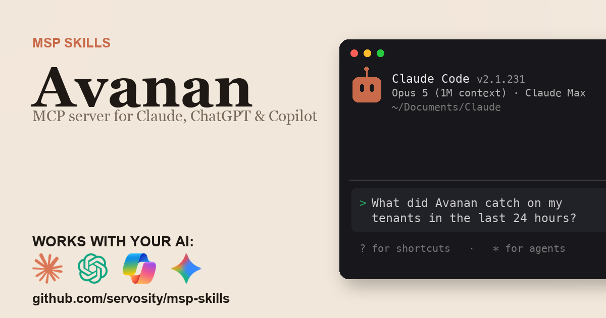

# Avanan + AI - for ChatGPT, Claude, GitHub Copilot, Microsoft 365 Copilot, Gemini, and any agent that speaks MCP

> Unofficial. Community-built Claude Code Skill and MCP server for the Avanan
> API. Not affiliated with, endorsed by, or sponsored by Check Point.
> Avanan and Harmony Email & Collaboration are trademarks of Check Point
> Software Technologies Ltd.

<!-- media:start -->
<p align="center">
  <a href="https://msp-skills.compoundingteams.com/skills/avanan/">
    
  </a>
</p>
<!-- media:end -->

Every Avanan (Check Point Harmony Email and Collaboration) API operation, plus shift-start triage, phishing campaign clustering, single-message lifecycle timelines, one exception lookup across all seven security engines, and cross-tenant MSP fleet rollups that a stateless API mirror cannot answer in a single call. Works with the AI you already use - **ChatGPT** (Plus/Pro+), **Claude Desktop**, **Codex**, **Claude Code**, **Claude Cowork**, and **GitHub Copilot** - plus **Microsoft 365 Copilot / Copilot Studio** and **Google Gemini** via the remote path. Free, open source, runs on your laptop. Built for MSP owners. No code required.

## Works with your agent

The six agents MSP owners actually use (self-serve, works today):

| Your AI agent | How to install the Avanan skill |
| --- | --- |
| **Claude Desktop** | Run installer, then **Settings > Extensions** to register `avanan-mcp` (no JSON editing). |
| **ChatGPT** (paid plans) | Run installer, expose `avanan-mcp` over HTTPS, register as a Developer Mode connector. |
| **Codex CLI** | Paste the install prompt below. |
| **Claude Code** | Paste the install prompt below. |
| **Claude Cowork** | Paste the install prompt below. |
| **GitHub Copilot** (VS Code) | Run installer, add `avanan-mcp` to `mcp.json` under the `servers` key, then pick **Agent** mode. |

For ChatGPT, the Avanan MCP server is stdio - to use it with ChatGPT you expose it over HTTPS via the `mcp-remote` bridge or your own endpoint. See [mcp-install.md](./mcp-install.md).

### Also for the Microsoft and Google stacks

Big install base, but an honest heads-up: these are the **remote / enterprise** path, not the local binary you just installed.

| Agent | What it takes |
| --- | --- |
| **Microsoft 365 Copilot / Copilot Studio** | **Not self-serve.** Host `avanan-mcp` over HTTPS, then wire it into Copilot Studio (**Tools > Add a tool > Model Context Protocol > Server URL**) or a declarative agent. Needs a Copilot Studio license + tenant admin. See [mcp-install.md](./mcp-install.md). |
| **Google Gemini** | **Gemini CLI** is local - same as Claude Code. The **Gemini app** is remote - same HTTPS path as ChatGPT. See [mcp-install.md](./mcp-install.md). |

## Install in 60 seconds

Prefer the Claude Code plugin? Add the marketplace once, then install:

```
/plugin marketplace add Servosity/msp-skills
/plugin install avanan@msp-skills
```

### Path A - paste one prompt into your AI agent (recommended)

Copy this into **Claude Code**, **Codex CLI**, or **Claude Cowork**:

> Install the Avanan Skill and MCP server from Servosity/msp-skills in this agent workspace. If this workspace uses a POSIX shell (macOS, Linux, WSL, or Bash), run `bash <(curl -fsSL https://raw.githubusercontent.com/Servosity/msp-skills/main/skills/avanan/install.sh)`. If it uses Windows PowerShell, run `iwr -useb https://raw.githubusercontent.com/Servosity/msp-skills/main/skills/avanan/install.ps1 | iex`. Then authenticate per the README and run `avanan-cli --help` to explore.

The same prompt works in any agent that can run shell.

### Path B - run the installer yourself

**Windows (PowerShell):**

```powershell
iwr -useb https://raw.githubusercontent.com/Servosity/msp-skills/main/skills/avanan/install.ps1 | iex
```

**macOS / Linux:**

```bash
bash <(curl -fsSL https://raw.githubusercontent.com/Servosity/msp-skills/main/skills/avanan/install.sh)
```

The installer drops both `avanan-cli` (the CLI) and `avanan-mcp` (the MCP server) into your user bin path. Claude Code, Codex, and Cowork discover the Skill via `SKILL.md` in this directory.

Verify:

```bash
avanan-cli --version
```

### Upgrade to the latest version

The installer always fetches the current release - re-run it to upgrade:

**macOS / Linux:**

```bash
bash <(curl -fsSL https://raw.githubusercontent.com/Servosity/msp-skills/main/skills/avanan/install.sh)
```

**Windows (PowerShell):**

```powershell
iwr -useb https://raw.githubusercontent.com/Servosity/msp-skills/main/skills/avanan/install.ps1 | iex
```

Claude Code plugin users: `/plugin update avanan@msp-skills`.

### Add to Claude Desktop, GitHub Copilot, Gemini CLI, Microsoft 365 Copilot, or another MCP client

After the installer runs, see **[mcp-install.md](./mcp-install.md)** and **[docs/which-agent.md](../../docs/which-agent.md)** for the per-agent wire-up - one section per agent, including the GitHub Copilot `servers` key and the remote Microsoft 365 Copilot / Copilot Studio path. Claude Desktop's Settings > Extensions panel is the simplest path; the MCP config block (for users who prefer editing JSON) is documented in mcp-install.md.

<!-- pp-hermes-install-anchor -->
### Install for Hermes

From the Hermes CLI:

```bash
hermes skills install servosity/msp-skills/skills/avanan --force
```

Inside a Hermes chat session:

```
/skills install servosity/msp-skills/skills/avanan --force
```

Hermes [speaks MCP natively](https://hermes-agent.nousresearch.com), so it can also use the `avanan-mcp` server directly - same install path, same env vars.

### Install for OpenClaw

Tell your OpenClaw agent (copy this):

> Install the avanan skill from https://github.com/servosity/msp-skills/tree/main/skills/avanan. The skill defines how its required CLI (`avanan-cli`) can be installed via the `openclaw:` frontmatter block.

OpenClaw isn't generally available yet; the frontmatter wiring is pre-shipped and will activate the moment OpenClaw launches.

### Authenticate

Set the application credential the CLI needs (Avanan portal > Settings > API Keys), then mint a session token for your region:

```bash
export AVANAN_APP_ID=<your application id>
export AVANAN_CLIENT_SECRET=<your client secret>
avanan-cli auth login --region us --save
avanan-cli doctor
```

`doctor` confirms the credentials work, and prints which of the two auth schemes and which regional host it resolved, before you run anything that touches data.

Two properties of Avanan credentials are worth knowing up front:

- **`--since` filters on Avanan's ingest time, not the message date.** The API's
  `startDate`/`endDate` match `entityCreated` - when Avanan scanned the message -
  which normally tracks the received header within seconds but can lag it by
  well over an hour. A window can therefore miss mail that arrived inside it and
  was scanned after it. Widen the window rather than assuming message age.
- **Actions need the SaaS entity type, not a generic one.** Quarantine and
  restore take `office365_emails_email` or `google_mail_email`; `remediate`
  resolves this from the entity itself, and `--entity-type` overrides it.
- **Regions are hard-isolated.** Credentials are issued per region and cross-region reads are refused by design, so a USA key returning nothing for an EU tenant is not a broken key. Valid regions: `us`, `eu`, `ca`, `ap`, `uk`, `uae`, `in`, plus `infinity` and `infinity-us` for the Infinity Portal gateways. On any other Infinity Portal gateway there is no region code - point the CLI at it with `--base-url` or `AVANAN_BASE_URL`.
- **One application credential can reach many tenants.** Run `avanan-cli scopes` to see exactly which `{farm}:{tenant}` scopes yours covers. That is also your best control - a credential bound to one tenant puts the whole fleet out of reach. See [governance.md](./governance.md).

### Sync before you ask

Most of the cross-tenant answers come from a local mirror. Populate it once:

```bash
avanan-cli mirror --since 7d
avanan-cli sync --resources msp
```

`mirror` and `sync` are read-only against the Avanan API and write to a SQLite file under your own user account. Re-run them whenever you want fresher data. The offline commands (`triage`, `campaign`, `timeline`, `exceptions find`, `exceptions audit`, `msp fleet`) read the mirror only and will report empty results against an unpopulated store rather than silently falling back to a live fan-out.

## What this skill does

| Question your MSP keeps asking | Command |
| --- | --- |
| What did Avanan catch across my tenants since the start of my shift? | `avanan-cli triage --since 24h` |
| Are these forty detections one phishing campaign or forty problems? | `avanan-cli campaign --since 7d` |
| A user disputes a quarantine. What actually happened to that message? | `avanan-cli timeline <entity-id>` |
| Is this domain, sender, URL, or hash already excepted anywhere? | `avanan-cli exceptions find example.com` |
| Which of our exceptions contradict each other or have not matched traffic in the mirrored window? | `avanan-cli exceptions audit` |
| Which tenant is over its seat count or having an unusual week? | `avanan-cli msp fleet` |
| Quarantine this batch and tell me the real per-message outcome | `avanan-cli remediate quarantine --entity <id> --scope <farm:tenant> --wait` |
| Is my auth and connectivity actually working? | `avanan-cli doctor` |

Full command reference: [guide.md](./guide.md). For the AI-agent operating contract (`--agent`, `--dry-run`, when to confirm before mutating), see [AGENTS.md](./AGENTS.md).

## What makes this different

Avanan already has integrations for Cortex XSOAR, Microsoft Sentinel, n8n, and two community MCP servers. Every one of them is a plugin that lives inside another product, and **every one of them is stateless**: one question, one API call, no history. There is no terminal-native tool, and nothing that can answer a question spanning two tenants or two days without paying for N more calls against an API that returns HTTP 429 and publishes no quota.

This skill syncs events, entities, exceptions, and MSP objects into a **local SQLite mirror**, so those questions become one local join. That is what turns "here are 400 detections" into "here are three campaigns, one of which is still 40% un-remediated."

It also covers more of the API than the published spec does. The SwaggerHub spec omits the auth endpoint, the entire per-sectool exception surface, and the SOAR and download helpers - about 15 operations that are documented on the vendor reference site and proven in shipping XSOAR and Sentinel code. Those are all here.

And it implements the request signature correctly. The legacy handshake signs `reqId + appId + date + requestString + secret`, and that `requestString` term is present on every non-auth call and absent from the published docs - so a client that builds the query string differently from the string it signed gets a 401 that looks exactly like a bad credential. This CLI signs and sends through one code path.

## The pain this closes

- The event endpoint hands back detections but never buckets them, so a shift starts by re-scrolling the query you already ran an hour ago. `avanan-cli triage` returns a digest by threat type, severity, and state with the sender domains driving the volume.
- Nothing groups detections, so telling one phishing run from forty unrelated problems means sorting an export by sender and subject. `avanan-cli campaign` clusters them and shows recipient spread and remediation state.
- A disputed quarantine spans five lookups across three endpoints, and the task record ages out. `avanan-cli timeline` reconstructs one message's history in order from what the mirror holds and what this CLI submitted, after the fact.
- Exceptions live in seven engines and nine tables with different path shapes, ID schemes, and delete semantics, and nothing answers "is this already excepted." `avanan-cli exceptions find` asks all of them at once; `avanan-cli exceptions audit` finds the contradictions, duplicates, and entries that have not matched traffic in the mirrored window.
- Actions are asynchronous and single-scope: the endpoint returns a task ID and rejects a multi-tenant credential with a bare HTTP 400. `avanan-cli remediate` waits for the task, reports the real per-item outcome, and turns that 400 into an error naming the scopes you can actually target.

See [pain-point.md](./pain-point.md) for the longer narrative.

## Frequently asked questions

### Does this work with ChatGPT?

Yes, on **Plus, Pro, Team, Business, Enterprise, and Education** plans (Free tier does not yet expose Developer Mode). ChatGPT connects to **remote** MCP servers over HTTPS, not local stdio binaries. The Avanan MCP server is local, so for ChatGPT you expose it via the `mcp-remote` bridge or your own HTTPS endpoint. Step-by-step in [mcp-install.md](./mcp-install.md).

### Does this work with Codex, Cursor, Windsurf, Cline, Copilot, or Gemini?

Yes - all of them speak MCP. Cross-tool install commands are in the matrix above and the deep-dive in [docs/which-agent.md](../../docs/which-agent.md).

### Do I need to know how to code?

No. The recommended install is to paste one sentence into Claude Code or Codex - your agent reads `SKILL.md` and does the install. The fallback is a one-line installer per OS (bash or PowerShell). Neither path requires writing code. You'll enter your Avanan application ID and client secret once.

### Is my Avanan data safe?

Your data stays on **your machine**. The CLI and MCP server are local binaries, and the MCP server speaks stdio only - it opens no network listener. The SQLite mirror sits in a directory under your user account. The AI agent only sees what the CLI returns - typically a query result, not raw bulk data. Message bodies and raw `.eml` files are only fetched when you explicitly ask for a named message. Credentials are read from your environment or your agent's config; never bundled into this repo or transmitted anywhere by MSP Skills.

### Will this hit my Avanan API rate limits?

Mostly no. The skill mirrors once into local SQLite, then answers from local data, so the offline commands answer without spending API quota. Avanan publishes no quota numbers but does return HTTP 429, so the client backs off on its own, and the six offline commands cost nothing after the mirror is populated.

### Do I need an MSP account, or does this work on a single tenant?

Both. The `msp` commands and the fleet rollup need an application credential bound to multiple tenants, but triage, campaign, timeline, exception lookup, search, and remediation all work fine against a single-tenant credential.

### Why does my Avanan credential fail against a different region?

Avanan regions are hard-isolated and credentials are issued per region, so a USA key cannot read EU data by design. Set the region once with `avanan-cli auth login --region <us|eu|ca|ap|uk|uae|in|infinity|infinity-us> --save`. An Infinity Portal tenant on any other gateway has no region code and sets `avanan-cli auth login --base-url https://<your-infinity-gateway> --save` instead. `avanan-cli doctor` prints the host it resolved.

### Why do quarantine and restore ask for a scope?

Avanan's action endpoints accept exactly one scope and reject a multi-tenant credential with a bare HTTP 400 that reads like a bad key - the most common integration footgun on this API. `remediate` turns that into an error naming the scopes your credential actually covers, so a mailbox-affecting write cannot land on a tenant you did not name.

### Does it cover Check Point firewall or endpoint products?

No. This covers Avanan / Harmony Email and Collaboration only: email and SaaS collaboration security. Check Point system and audit logs live on the separate Infinity Portal API and are not part of this one.

### Will this replace the Avanan portal?

No, it complements it. Security policy rules and engine configuration are portal-only - the API exposes exceptions, not policy. This skill answers the questions and does the batch work the portal makes slow.

### What does it cost?

Free. Apache-2.0 licensed. You pay only for whichever AI agent you use (Claude, ChatGPT, Codex, etc.), and that's billed by your AI provider, not by us.

## Safety model

| Tier | Examples | Recommended agent policy |
| --- | --- | --- |
| Read | `triage`, `campaign`, `timeline`, `exceptions find`, `exceptions audit`, `msp fleet`, `event query`, `scopes`, `search`, `mirror`, `sync`, `export`, and the `list` / `get` commands not named in the tiers below | Allow |
| Message content egress | `download`, `download-large-email`, `avanan-search get-saas-entity` (`soar get-entity` currently returns 404 on every tenant tested) | Only for a named message under an open investigation; never sweep |
| Write (routine) | `exceptions create`, `exceptions update`, `sectool-exceptions create`, `sectools create-ctp-item`, `report` | Preview with `--dry-run`, then a reviewed write |
| Bulk write (`import`) | `import` (bulk POST from JSONL; `import action` reaches live mail, `import soar` notifies end users, `import msp` mutates tenants) | Human-approved only. It inherits the tier of whatever resource it targets, and the resources it accepts reach the mailbox-affecting and human-in-the-loop endpoints below. Preview with `--dry-run` first. |
| Mailbox-affecting | `remediate quarantine`, `remediate restore`, `action post-entity`, `action post-event` | Human-approved, always with an explicit `--scope` |
| End-user contact | `soar post-notify` | Human-in-the-loop only |
| Tenant and billing lifecycle | `msp create-tenants`, `msp create-users`, `msp update-or-create-tenant-license` | Human-in-the-loop only |
| Destructive | `msp delete-tenants`, `msp delete-users`, `exceptions delete`, `sectool-exceptions delete`, `sectools delete-ctp-lists` | Human-in-the-loop only, explicit confirmation |

Two rows reach outside a dashboard. `remediate` and the `action` commands quarantine and restore live mail in a customer's Microsoft 365 or Google Workspace, and `soar post-notify` emails real people on your behalf. Treat both with the approval you already require for touching a user's mailbox. `msp delete-tenants` deletes an entire customer tenant and has no peer here for blast radius.

The strongest control is the **scope of the application credential** - it is bound to one region and to a specific set of tenants, and the CLI can only reach what it covers. Full details, including how to lock it down, are in [governance.md](./governance.md).

## Status

Beta. Built and verified offline: the full command tree builds and passes its test suite, `doctor` resolves config, region, and connectivity, the MCP stdio handshake lists the full tool surface, and every mutating command was exercised under `--dry-run` only. It has **not** yet been run against a production Avanan tenant - the `live_verified` badge stays `awaiting` until an MSP running their own tenant confirms it. Being validated with MSPs in our weekly Build Sessions. RSVP at [compoundingteams.com/build-sessions](https://compoundingteams.com/build-sessions).

---

**Standards.** Conforms to the open [Agent Skills spec](https://agentskills.io) (Anthropic, Dec 2025; 40+ agents). MCP-compatible - works with any MCP-capable agent including [Hermes](https://hermes-agent.nousresearch.com). OpenClaw-ready (frontmatter pre-wired, awaiting OpenClaw launch).

Maintained by [Servosity](https://www.servosity.com). Apache-2.0 licensed. Built with [CLI Printing Press](https://github.com/mvanhorn/cli-printing-press). _Last updated: 2026-08-15._
